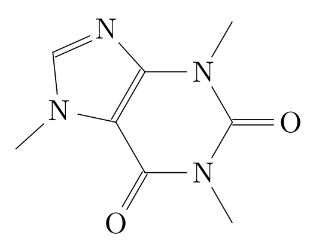
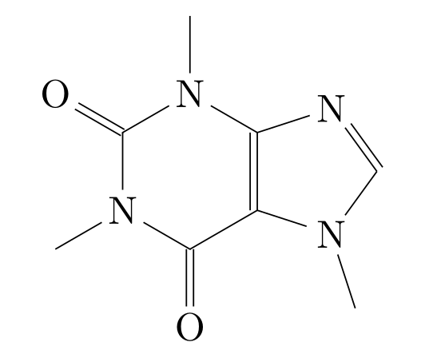

#+title: tochemfig.el
#+author: Giovanni Crisalfi

# /Manipulating molecules with Emacs/.

=tochemfig= converts molecular structures into LaTeX/chemfig code directly within Emacs.

[[./default-demo.gif]]

* Requirements

- Emacs 25.1+ with dynamic module support
- [[https://github.com/gicrisf/emacs-indigo][emacs-indigo]] (Emacs bindings for the Indigo cheminformatics library)
- LaTeX with chemfig and TiKZ packages (for rendering output)

The package generates chemfig code natively in Elisp using =emacs-indigo= for molecular structure handling. No Python or external commands required.

* Quickstart

The following is a SMILES representation of caffeine:

#+begin_src
CN1C=NC2=C1C(=O)N(C(=O)N2C)C
#+end_src

You can turn this string into chemfig code by running =M-x tochemfig-input-direct=.

The minibuffer will request an input: paste the SMILES, press =RET=, and Emacs will insert the chemfig code directly into your buffer.

#+begin_export latex
\chemfig{
            % 1
      -[:42]N% 2
      -[:96]% 3
     =_[:24]N% 4
     -[:312]% 5
    =_[:240]% 6
               (
         -[:168]\phantom{N}% -> 2
               )
     -[:300]% 7
               (
         =[:240]O% 8
               )
           -N% 9
               (
         -[:300]% 14
               )
      -[:60]% 10
               (
               =O% 11
               )
     -[:120]N% 12
               (
         -[:180]% -> 5
               )
      -[:60]% 13
}
#+end_export

Export the LaTeX document as a PDF to see the rendered molecule:

#+DOWNLOADED: screenshot @ 2022-11-08 00:39:41
#+CAPTION: Caffeine rendered by LaTeX/TiKZ

This is fine, but maybe we're used to seeing xanthines with a slight rotation, with the imidazole ring on the right and parallel to the ground.

#+DOWNLOADED: screenshot @ 2022-11-08 00:50:01
#+Caption: Caffeine rendered by LaTeX/TiKZ, flipped and rotated

To obtain this result, rotate the molecule by -30° and flip it horizontally using =M-x tochemfig-rotate=.

You can also set these as defaults in your config:

#+begin_src emacs-lisp
(setq tochemfig-default-input 'direct)
(setq tochemfig-default-angle -30.0)
(setq tochemfig-default-flip t)
#+end_src

* Installation

** Prerequisites: emacs-indigo

First, install =emacs-indigo=, which provides the molecular structure handling capabilities:

#+begin_src bash
git clone https://github.com/gicrisf/emacs-indigo.git
cd emacs-indigo
./install.sh
#+end_src

The install script automatically downloads and builds all dependencies (zlib, TinyXML, Indigo library) locally, then compiles the Emacs dynamic module.

Add to your Emacs config:

#+begin_src emacs-lisp
(add-to-list 'load-path "/path/to/emacs-indigo")
#+end_src

** Installing tochemfig

*** Doom Emacs

#+begin_src emacs-lisp :tangle packages.el
(package! tochemfig
  :recipe (:host github :repo "gicrisf/tochemfig"))
#+end_src

#+begin_src emacs-lisp
;; in ~/.doom.d/config.el
(add-to-list 'load-path "/path/to/emacs-indigo")
(use-package! tochemfig)
#+end_src

*** straight.el

#+begin_src emacs-lisp
(straight-use-package
 '(tochemfig :type git :host github :repo "gicrisf/tochemfig"))
(add-to-list 'load-path "/path/to/emacs-indigo")
#+end_src

*** Manual

Clone this repository and add both paths:

#+begin_src emacs-lisp
(add-to-list 'load-path "/path/to/emacs-indigo")
(add-to-list 'load-path "/path/to/tochemfig")
(require 'tochemfig)
#+end_src

** Nix

For Nix users, =emacs-indigo= provides a flake:

#+begin_src bash
cd emacs-indigo
nix build
#+end_src

The built package will be available in =./result=. Add the result path to your Emacs load-path, or integrate it with your Nix-based Emacs configuration.

* Usage

There are *3 ways* to use tochemfig:

1. *Quick generation* with =tochemfig-default=: Input your molecule and get chemfig code instantly using your configured defaults.

2. *Step-by-step customization* with =tochemfig-custom=: Opens an interactive dialog to customize each parameter before generating. Useful for beginners and one-off adjustments.

   [[./custom-multiedit-demo.gif]]

3. *Single-parameter override*: Functions like =tochemfig-input-direct=, =tochemfig-rotate=, or =tochemfig-fancy-bonds= let you override one specific setting while keeping all other defaults.

   [[./custom-one-edit-demo.gif]]

** Example: Single-parameter override

If your default input is set to =file= but you need to paste a SMILES directly, use =tochemfig-input-direct= instead of changing your defaults or going through the full customization wizard.

Similarly, =tochemfig-terse= generates compact output without whitespace, =tochemfig-fancy-bonds= enables fancier double/triple bond rendering, etc.

** Customizing defaults

Set your preferred defaults in your config file:

#+begin_src emacs-lisp
;; Input mode: 'direct for SMILES, 'file for MOL files
(setq tochemfig-default-input 'direct)

;; Use relative angles instead of absolute
(setq tochemfig-default-relative-angles t)

;; Enable fancier double/triple bond rendering
(setq tochemfig-default-fancy-bonds t)

;; Wrap output in \chemfig{...}
(setq tochemfig-default-wrap-chemfig t)

;; Rotate all molecules by default
(setq tochemfig-default-angle -30.0)
#+end_src

To see all available commands, run =M-x tochemfig-= and explore the completion list.

* Features

- [X] *Generate chemfig code from SMILES strings*
- [X] *Generate chemfig code from MOL files*
- [X] Flip structure horizontally or vertically
- [X] Rotate structure by custom angle
- [X] Generate compact (terse) or formatted output
- [X] Use relative or absolute bond angles
- [X] Show/hide carbon labels
- [X] Show/hide methyl group labels
- [X] Add or remove explicit hydrogen atoms
- [X] *Draw fancier double and triple bonds*
- [X] Show atom numbers for debugging
- [X] Scale or normalize bond lengths
- [X] Wrap output in =\chemfig{...}= command
- [X] *Define submols* with entry/exit atoms
- [X] Export submols as external =.tex= files
- [X] *Customizable defaults*
- [X] *Step-by-step parameter wizard*
- [X] Single-parameter override commands

* Donate

Did you find this package useful? If you'd like to help me stay awake (writing code, wink wink), consider buying me a coffee.

[[https://ko-fi.com/V7V425BFU][https://ko-fi.com/img/githubbutton_sm.svg]]

* License

Open sourced under the [[./LICENSE][MIT license]].
